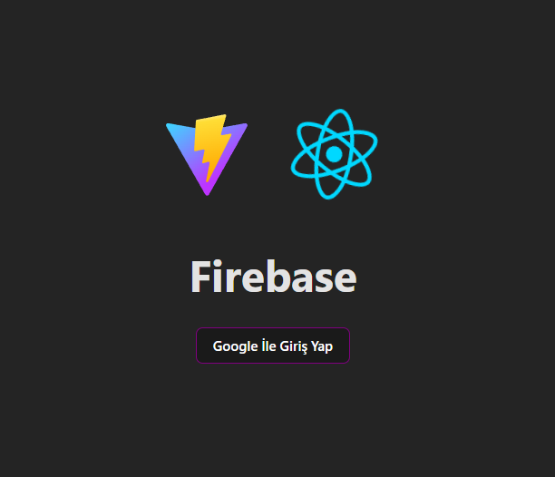

<h1>React Firebase Giriş Uygulaması</h1>

Bu proje Google hesabı kullanarak Firebase Authentication ile giriş yapmak için geliştirilmiş bir mini projedir. Firebase, Google tarafından sunulan bir platformdur ve uygulama geliştiricilerine sunulan bir dizi araç ve hizmetle uygulama geliştirmeyi kolaylaştırır 

<h2>Firebase Nedir?</h2>

Firebase, Google tarafından sunulan bir platformdur ve uygulama geliştiricilerine sunulan bir dizi araç ve hizmetle uygulama geliştirmeyi kolaylaştırır. Bulut tabanlı bir hizmet olarak, sunucu yönetimi, veritabanı yapılandırması ve diğer altyapı zorluklarına odaklanmak yerine uygulama geliştirmeye odaklanmanıza olanak tanır.

<h2>Firebase Özellikleri</h2>

<ol>
<li>Authentication (Kimlik Doğrulama):</li>
Firebase Authentication, kullanıcıların uygulamanıza kaydolmasını, giriş yapmasını ve hesaplarını yönetmesini sağlar.B, e-posta/şifre doğrulaması, sosyal medya hesaplarıyla giriş, telefon numarası doğrulaması ve diğer kimlik doğrulama yöntemlerini destekler.
<li>Realtime Database (Gerçek Zamanlı Veritabanı):</li>
Firebase Realtime Database, gerçek zamanlı olarak senkronize edilen bir NoSQL veritabanıdır. Bu uygulamanızdaki verilerin anlık olarak güncellenmesini ve tüm kullanıcılar arasında eşitlenmesini sağlar.
<li>Cloud Firestore:</li>
Firestore, Firebase'in esnek, ölçeklenebilir bulut tabanlı NoSQL veritabanıdır. Belge-tabanlı bir veritabanı olarak, daha karmaşık veri yapıları ve sorgular için daha iyi performans sunar.
<li>Storage (Depolama):</li>
Firebase Storage, kullanıcıların uygulamanıza medya dosyalarını yüklemesini ve depolamasını sağlar. Bu, resimler, videolar ve diğer medya türlerini saklamak için kullanılır.
<li>Cloud Functions:</li>
Cloud Functions, Firebase projenize bağlı olarak çalışan, ölçeklenebilir ve yönetilen işlevleri sağlar. Bu, kullanıcı etkileşimlerine tepki veren veya veritabanı güncellemeleri gibi olayları dinleyen arka uç kodunu çalıştırmak için kullanılır.
<li>Hosting:</li>
Firebase Hosting, web uygulamanızı hızlı ve güvenli bir şekilde yayınlamanızı sağlar. Global CDN, SSL sertifikaları ve kolayca kullanılabilir dağıtım araçlarıyla uygulamanızı çevrimiçi olarak hızlı bir şekilde yayınlamanıza olanak tanır.
</ol>

<h2>Firebase'in Avantajları</h2>
<ol>
<li>Hızlı Geliştirme:</li>
Firebase, uygulama geliştirme sürecini hızlandırır çünkü birçok aracı ve hizmeti tek bir platformda sunar. Bu, sunucu yönetimi veya altyapı konfigürasyonu gibi detaylara odaklanmak yerine uygulamanın özelliğine odaklanmanızı sağlar.
<li>Gerçek Zamanlı Veri Senkronizasyonu:</li>
Firebase'in gerçek zamanlı veritabanı ve Firestore gibi hizmetleri, verilerin anlık olarak senkronize edilmesini sağlar. Bu, kullanıcıların uygulamayı kullanırken diğer kullanıcıların yapmış olduğu değişiklikleri hemen görmesini sağlar.
<li>Ölçeklenebilirlik:</li>
Firebase, uygulamanızın büyümesine uyum sağlayacak şekilde ölçeklenebilir bir yapı sunar. Bu, milyonlarca kullanıcıya hizmet verebilme kapasitesi sağlar ve kullanımınız arttıkça otomatik olarak altyapıyı ölçeklendirir.
<li>Güvenlik:</li>
Firebase, kullanıcı kimlik doğrulaması, veri şifreleme ve güvenli bağlantılar gibi güvenlik önlemleri sunar. Bu, kullanıcı verilerinin güvenliğini ve gizliliğini sağlamak için önemli bir rol oynar.

<li>Analitik ve Performans İzleme:</li>
Firebase, uygulamanızın performansını ve kullanımını izlemek için kapsamlı analitik araçlar sunar. Bu, kullanıcı davranışlarını anlamak ve uygulamanızı sürekli olarak iyileştirmek için değerli bilgiler sağlar.
</ol>

